# PrepForge

> Adaptive DSA interview preparation platform. Your weaknesses, fixed first.

---

## Table of Contents

1. [System Overview](#1-system-overview)
2. [C4 — System Context](#2-c4--system-context)
3. [C4 — Container Architecture](#3-c4--container-architecture)
4. [C4 — Backend Components](#4-c4--backend-components)
5. [Adaptive Engine Design](#5-adaptive-engine-design)
6. [Sequence Diagrams](#6-sequence-diagrams)
7. [Database Schema](#7-database-schema)
8. [Deployment Architecture](#8-deployment-architecture)
9. [CI/CD Pipeline](#9-cicd-pipeline)
10. [AI Provider Strategy](#10-ai-provider-strategy)
11. [Local Development](#11-local-development)
12. [Sprint Plan](#12-sprint-plan)

---

## 1. System Overview

PrepForge solves a specific problem: developers grind hundreds of LeetCode problems randomly and still fail interviews. The root cause is not effort — it is lack of direction. PrepForge uses an adaptive engine to identify a user's weakest topic, select the right difficulty problem, and use AI coaching to accelerate improvement.

**Core differentiator:** Every competitor (LeetCode, AlgoExpert, NeetCode) is static — same problems, same order, for everyone. PrepForge is the only platform that adapts to each user individually.

### Tech Stack

| Layer | Technology | Reason |
|---|---|---|
| Frontend | Next.js 14 + TypeScript + Tailwind + shadcn/ui | App Router, RSC, dark mode first |
| Backend | Python 3.12 + FastAPI | Async-native, AI ecosystem, less boilerplate |
| ORM | SQLAlchemy 2.0 async + Alembic | Type-safe, async, versioned migrations |
| Database | PostgreSQL 15 | Relational data + JSONB for problem content |
| Cache | Redis 7 | Hint caching (7d TTL), recommendation caching |
| Auth | Clerk | Zero auth infrastructure to build or maintain |
| AI (dev/beta) | Ollama — llama3.1 | Free, local, M-chip fast |
| AI (prod) | Claude Haiku | One env var switch at launch |
| Code Execution | Judge0 | Sandboxed multi-language execution |
| Deployment | Railway | Zero-ops, auto-deploys, managed PostgreSQL + Redis |
| CI/CD | GitHub Actions | Secrets scan → test → deploy pipeline |

---

## 2. C4 — System Context

> Who uses PrepForge and what external systems does it talk to?

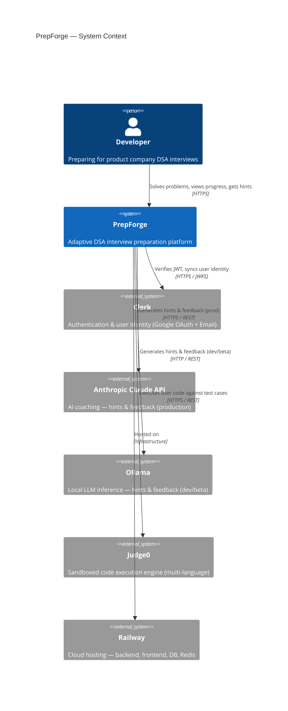

---

## 3. C4 — Container Architecture

> How is PrepForge decomposed into deployable units?

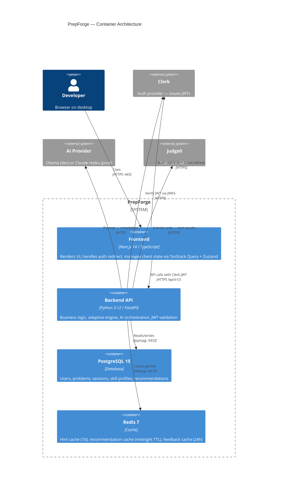

---

## 4. C4 — Backend Components

> How is the FastAPI backend internally structured?

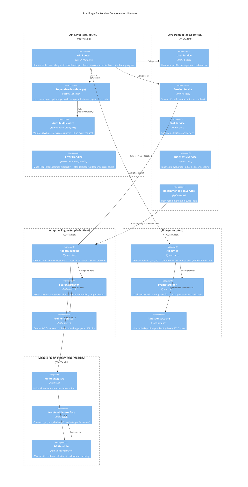

---

## 5. Adaptive Engine Design

> The core intelligence — how PrepForge decides what to show each user.

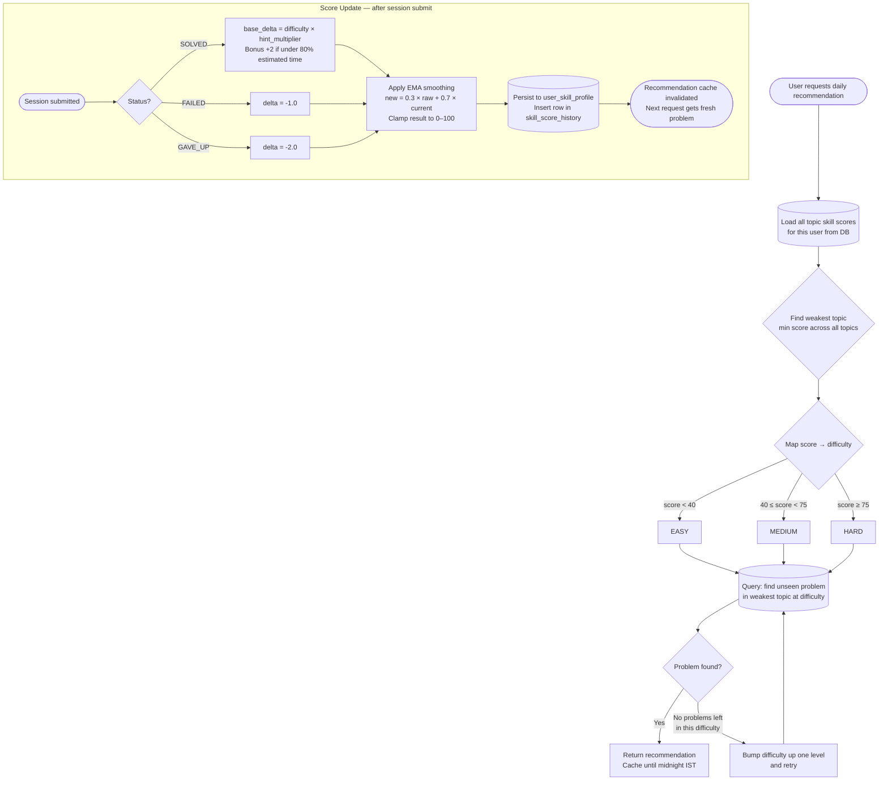

### Score Formula

```
BASE_DELTA  =  EASY: 8.0  |  MEDIUM: 12.0  |  HARD: 16.0

HINT_MULTIPLIER  =  0 hints: 1.0  |  1 hint: 0.6  |  2 hints: 0.4  |  3 hints: 0.2

raw_delta    =  BASE_DELTA × HINT_MULTIPLIER  (+2.0 speed bonus if applicable)
delta        =  min(raw_delta, 15.0)                    ← hard cap per session
new_score    =  clamp(0.3 × (current + delta) + 0.7 × current, 0, 100)   ← EMA α=0.3
```

---

## 6. Sequence Diagrams

### 6.1 User Authentication Flow

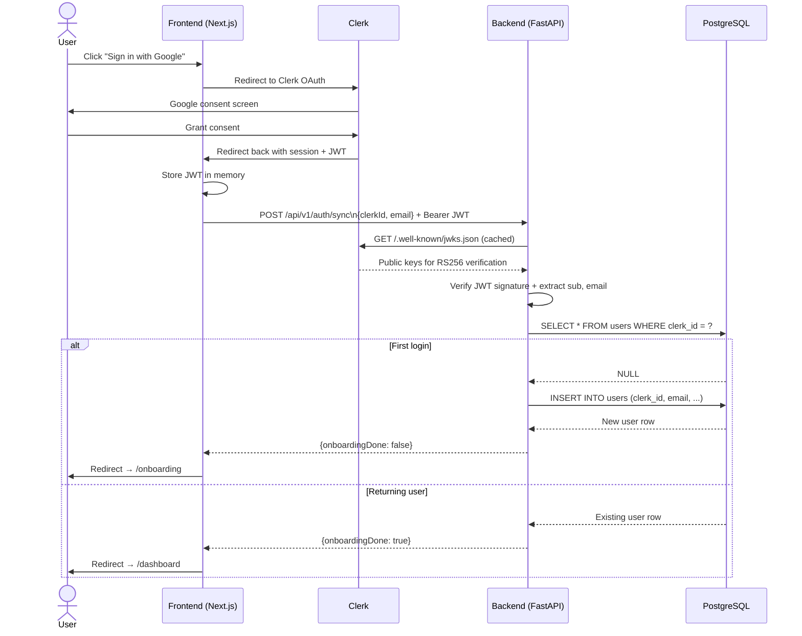

---

### 6.2 Daily Problem Recommendation Flow

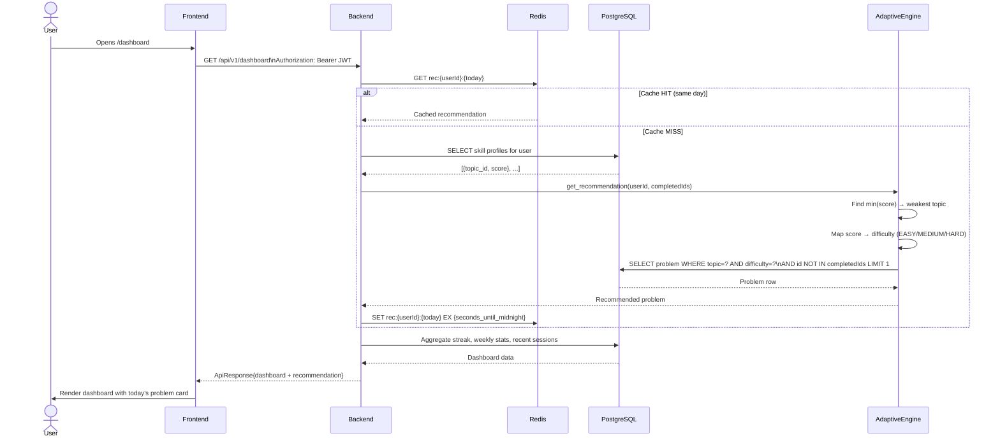

---

### 6.3 Problem Solving — Full Loop

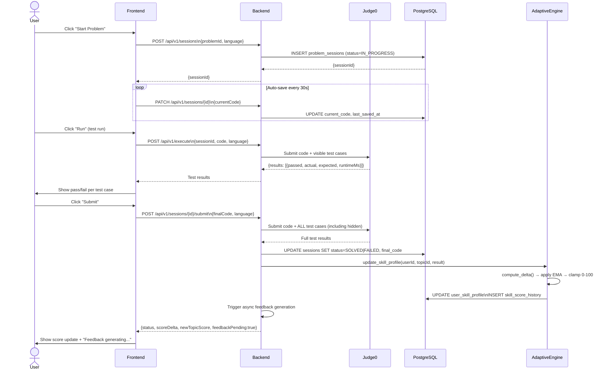

---

### 6.4 Hint Generation with Cache

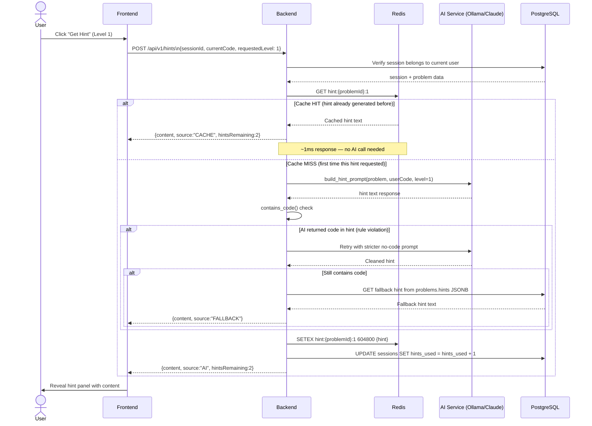

---

## 7. Database Schema

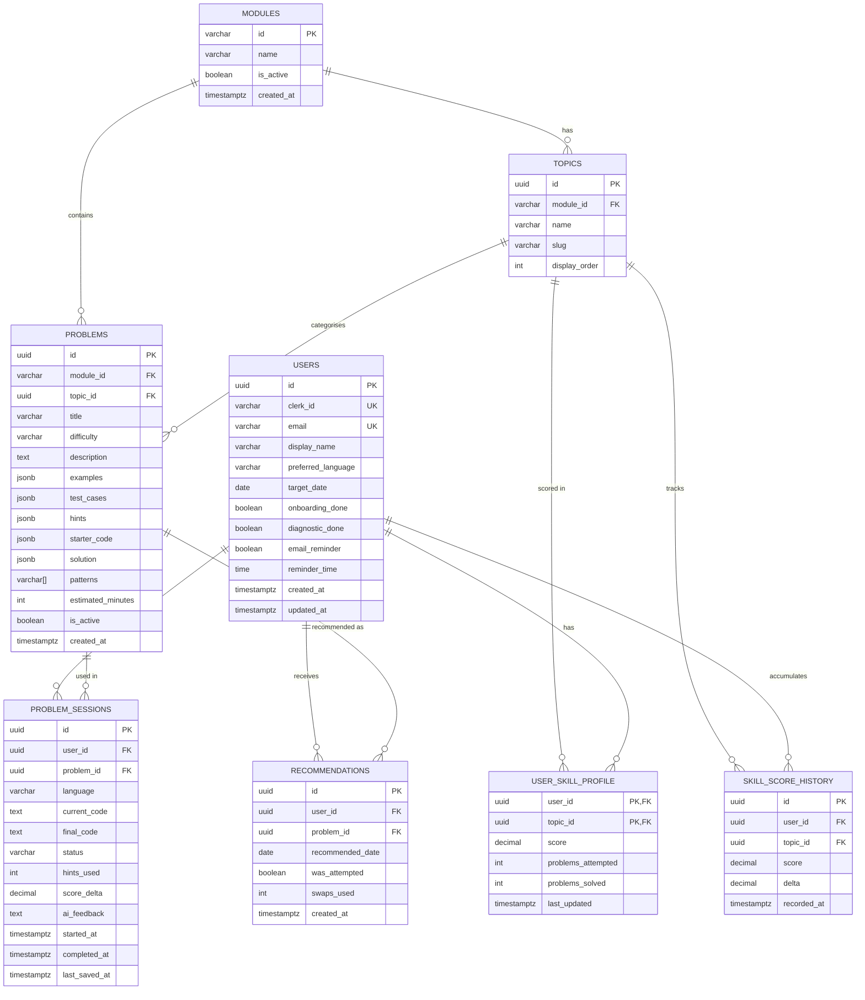

---

## 8. Deployment Architecture

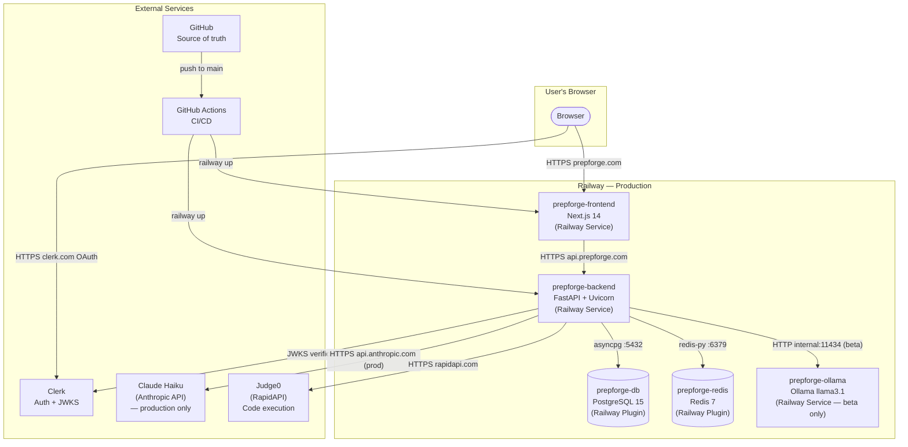

### Railway Services Overview

| Service | Type | Role |
|---|---|---|
| `prepforge-frontend` | GitHub deploy | Next.js app |
| `prepforge-backend` | Dockerfile deploy | FastAPI API |
| `prepforge-db` | Railway Plugin | PostgreSQL 15 — managed |
| `prepforge-redis` | Railway Plugin | Redis 7 — managed |
| `prepforge-ollama` | Dockerfile deploy | Ollama (beta only, decommissioned at launch) |

---

## 9. CI/CD Pipeline

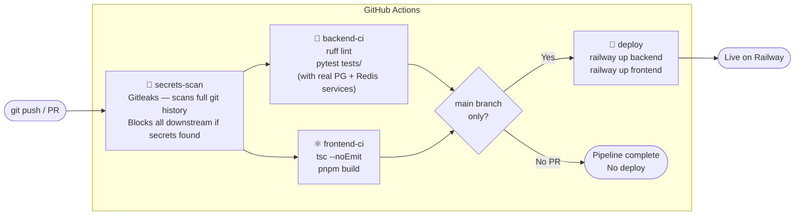

**Security gate:** `secrets-scan` runs first. If any API key, credential, or private key is detected in the commit or git history, the entire pipeline fails immediately. `backend-ci`, `frontend-ci`, and `deploy` all have `needs: [secrets-scan]` — nothing runs until the scan passes.

**Local gate:** `pre-commit` hooks run on every `git commit` before code ever reaches GitHub — gitleaks, ruff lint, YAML validation, private key detection.

---

## 10. AI Provider Strategy

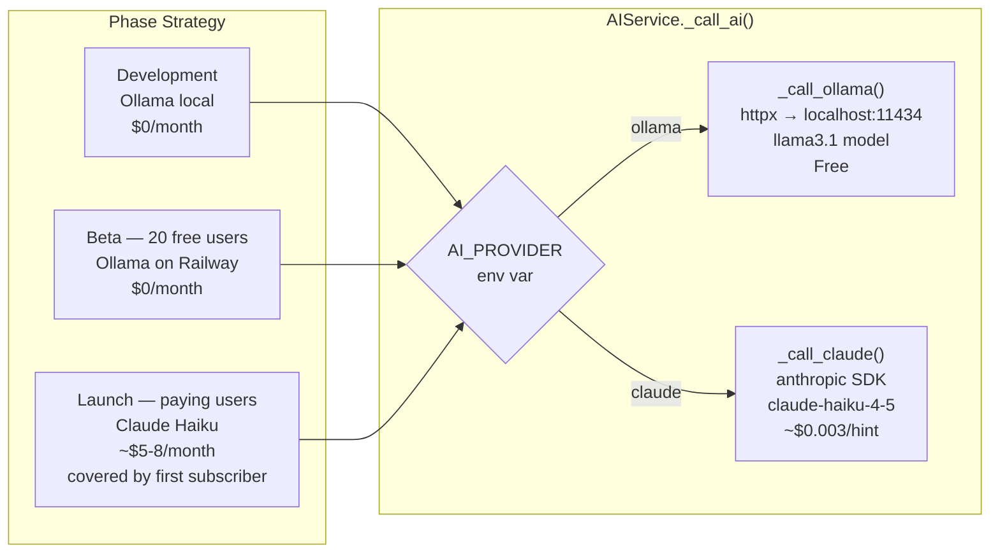

Switch at launch — **one environment variable, zero code change:**

```bash
# Beta
AI_PROVIDER=ollama
OLLAMA_URL=http://prepforge-ollama.railway.internal:11434

# Launch (update in Railway dashboard → auto redeploy)
AI_PROVIDER=claude
CLAUDE_API_KEY=sk-ant-your-production-key
```

---

## 11. Local Development

### Prerequisites
```bash
# Install tools (macOS)
brew install git node python@3.12 docker ollama pnpm railway
```

### Start Infrastructure
```bash
docker-compose up -d        # PostgreSQL :5432 + Redis :6379
ollama serve                # AI inference :11434
ollama pull llama3.1        # One-time model download (~4.7GB)
```

### Backend
```bash
cd backend
python3.12 -m venv .venv && source .venv/bin/activate
pip install -r requirements.txt
cp .env.example .env        # Fill in Clerk JWKS URL
pytest tests/ -v            # Must pass before proceeding
uvicorn app.main:app --reload --port 8000
```

- Health check: http://localhost:8000/api/v1/health
- API docs: http://localhost:8000/api-docs

### Frontend
```bash
cd frontend
pnpm install
cp .env.local.example .env.local   # Fill in Clerk publishable key
pnpm dev                           # http://localhost:3000
```

### Security Hooks (one-time setup)
```bash
pip install pre-commit
pre-commit install
pre-commit run --all-files          # Verify clean before first commit
```

---

## 12. Sprint Plan

| Sprint | Goal | Deliverable | Status |
|---|---|---|---|
| 0 | Scaffold + CI/CD | Working skeleton, pipeline green, first deploy | ✅ Done |
| 1 | Auth + Onboarding | Sign up → onboarding → profile saved in DB | 🔄 Next |
| 2 | Diagnostic + Skill Profile | Complete diagnostic → personalised skill scores | ⏳ |
| 3 | Core Problem Loop | Recommendation → solve → submit → score updated | ⏳ |
| 4 | Hints + Progress | Hints with cache, progress page, streak | ⏳ |
| 5 | Polish + Beta Prep | Error states, 100 problems seeded, Ollama on Railway | ⏳ |
| 6 | Beta + Payments | 20 users, Razorpay integration, first ₹499 payment | ⏳ |
| Launch | Go live | AI_PROVIDER=claude, custom domains, LinkedIn post | ⏳ |

---

*PrepForge v1.0 — Built in public*
*Solo founder: Anusruta Dutta*
